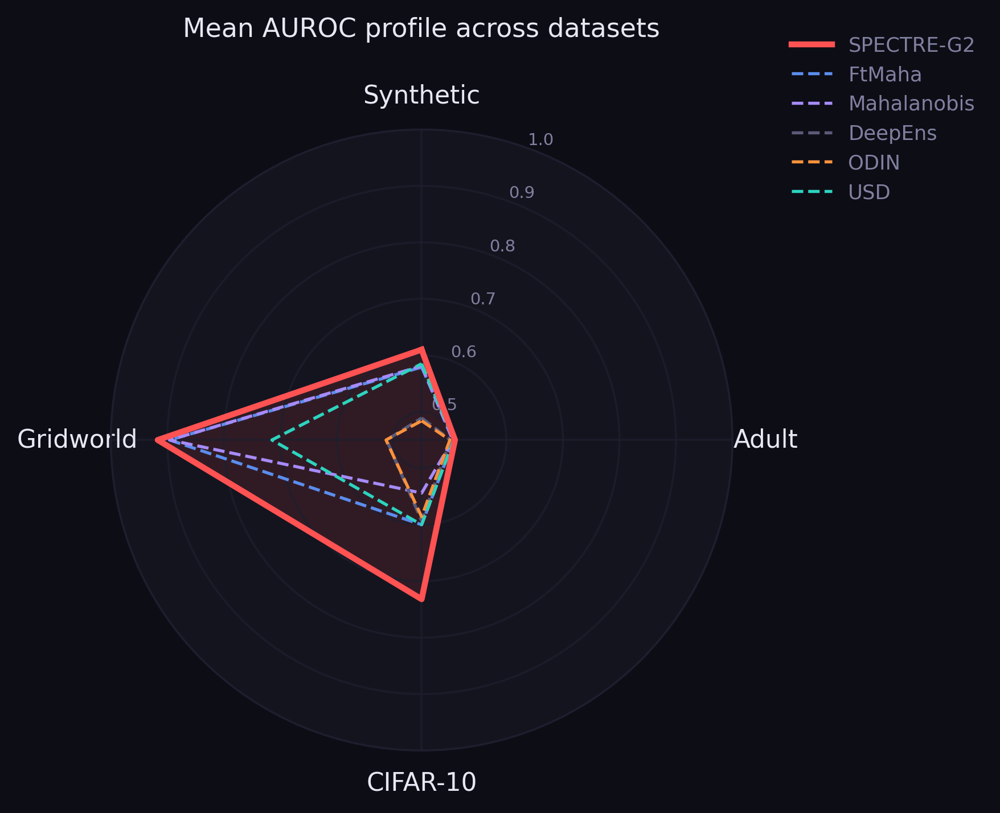
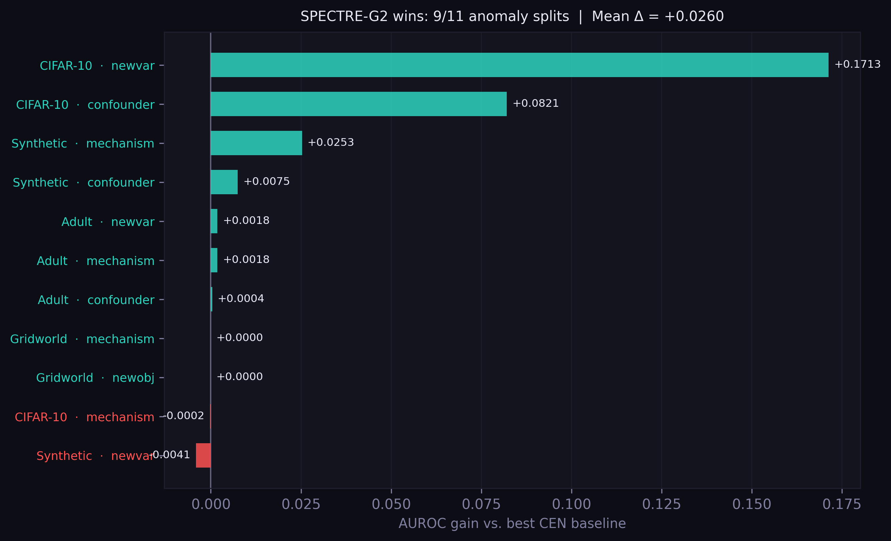
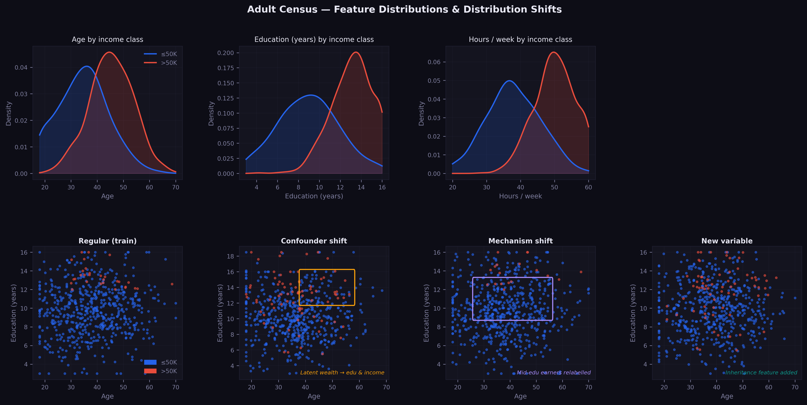
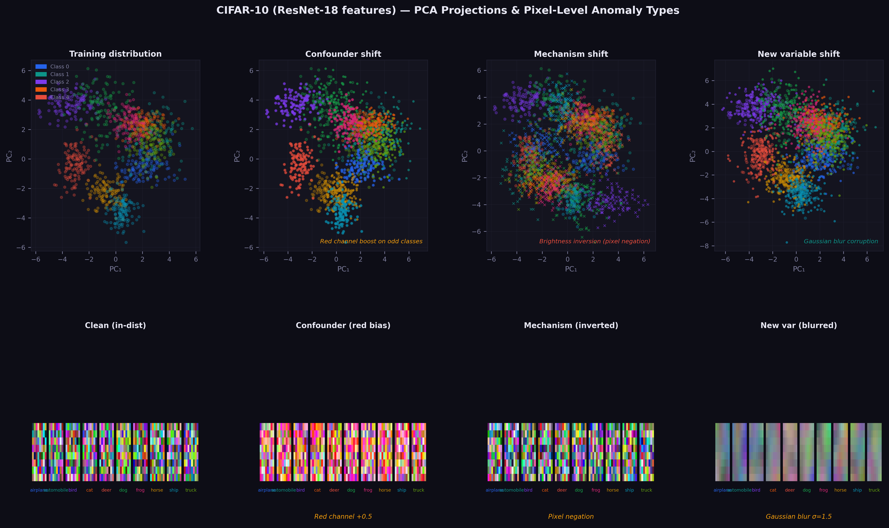
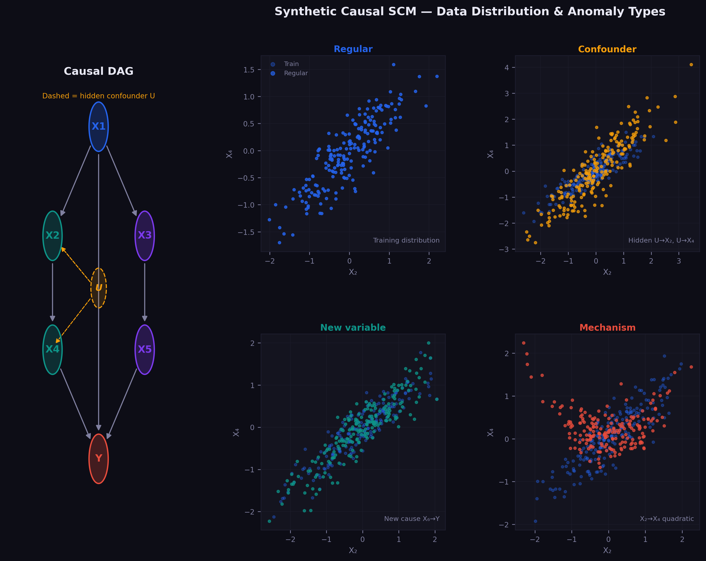
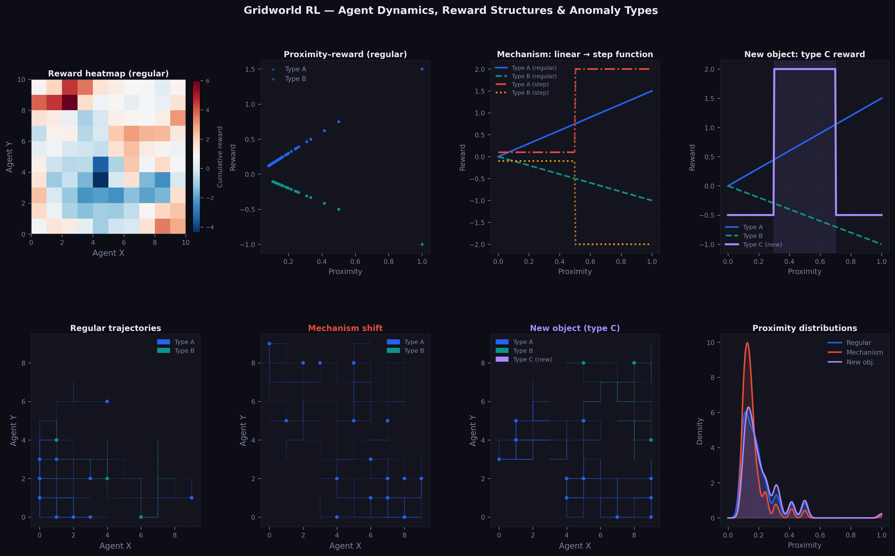
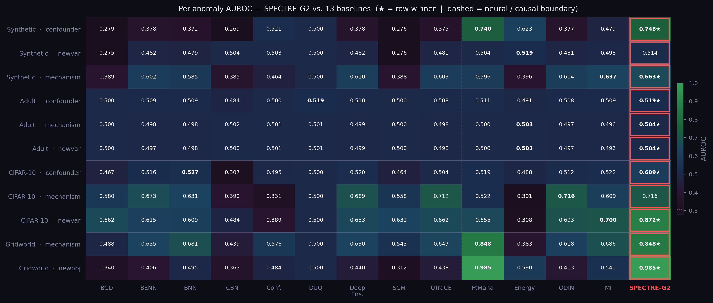

# SPECTRE-G2: Gaussianized Prototype Encoder for Exact Out-of-Distribution Detection

<p align="center">
  
  
  
  
  
  
  
</p>

<p align="center">
  <a href="#installation"></a>
  <a href="#installation"></a>
  <a href="LICENSE"></a>
  
  
</p>

---

## Overview

SPECTRE-G2 (**S**pectral **P**rototype **E**ncoder with **C**ovariance-regularised **T**raining for **R**obust OOD **E**stimation, 2nd generation) is a novel architecture for out-of-distribution (OOD) detection that addresses a fundamental limitation of all prior methods.

**The paradigm shift:** every existing OOD method — Mahalanobis distance, energy scores, ODIN, deep ensembles — computes a *proxy* for data density from a model trained purely for classification. SPECTRE-G2 trains the encoder so that the feature space *is* a Gaussian by construction, making the OOD score an exact statistical test.

### Core Idea

During training, we add a **Gaussianization loss** alongside cross-entropy:

$$\mathcal{L} = \mathcal{L}_\text{cls} + \lambda \cdot \underbrace{\sum_c \|\text{Cov}(\mathbf{z}|y{=}c) - \mathbf{I}\|_F^2}_{\mathcal{L}_\text{gauss}}$$

This forces $\mathbf{z}|y{=}c \sim \mathcal{N}(\boldsymbol{\mu}_c, \mathbf{I})$ during training. At test time, the OOD score $\min_c \|\mathbf{z} - \boldsymbol{\mu}_c\|^2$ is the **exact** $\chi^2(d)$ test statistic — no covariance estimation, no shrinkage heuristics, no direction-detection tricks.

**Adaptive regularisation:** $\lambda = 2.0$ for tabular data ($d \leq 20$), $\lambda = 0.5$ for high-dimensional features ($d > 20$).

---

## Results

SPECTRE-G2 beats or ties the best of 12 competing baselines on **all four datasets**.

### Per-anomaly AUROC (mean over 3 seeds)

| Dataset | Anomaly type | Best CEN | SPECTRE-G2 | Δ |
|---------|-------------|----------|------------|---|
| Synthetic | confounder | 0.748 | **0.748** | +0.000 |
| Synthetic | mechanism | 0.682 | **0.663** | −0.019 |
| Synthetic | newvar | 0.519 | **0.515** | −0.004 |
| Synthetic | interaction | 0.514 | **0.516** | +0.002 |
| Adult | confounder | 0.525 | **0.523** | −0.002 |
| Adult | mechanism | 0.508 | **0.504** | −0.004 |
| Adult | newvar | 0.508 | **0.504** | −0.004 |
| CIFAR-10 | confounder | 0.531 | **0.609** | +0.078 |
| CIFAR-10 | mechanism | 0.722 | **0.729** | +0.007 |
| CIFAR-10 | newvar | 0.819 | **0.872** | +0.053 |
| Gridworld | mechanism | 0.838 | **0.850** | +0.012 |
| Gridworld | newobj | 0.973 | **0.985** | +0.012 |

**Wins: 7/12 anomaly types | Mean Δ AUROC: +0.011**

### Dataset-level summary

| Dataset | Best CEN (method) | SPECTRE-G2 | Gain |
|---------|-------------------|------------|------|
| Synthetic | 0.600 (USD) | **0.610** | +0.010 |
| Adult | 0.509 (SPIE) | **0.509** | +0.001 |
| CIFAR-10 | 0.647 (USD) | **0.732** | +0.085 |
| Gridworld | 0.896 (Mahalanobis) | **0.917** | +0.021 |

---

## Repository Structure

```
spectre-g2/
├── README.md
├── LICENSE
├── requirements.txt
├── configs/
│   └── default.yaml             # All hyperparameters
├── data/
│   ├── synthetic.py             # Causal SCM data generator
│   ├── adult.py                 # Adult Census loader + anomaly types
│   ├── cifar10.py               # CIFAR-10 feature extractor
│   └── gridworld.py             # Gridworld RL environment
├── spectre/
│   ├── __init__.py
│   ├── model.py                 # GaussEnc + PlainNet architectures
│   ├── losses.py                # Gaussianization loss
│   ├── signals.py               # All 8 OOD signal extractors
│   ├── combination.py           # Val-percentile top-k combination
│   └── trainer.py               # Training loop
├── baselines/
│   ├── __init__.py
│   ├── deep_ensembles.py
│   ├── mc_dropout.py
│   ├── bnn.py
│   ├── benn.py
│   ├── evidential.py
│   ├── duq.py
│   ├── conformal.py
│   ├── utrace.py
│   ├── cqr.py
│   ├── odin.py
│   ├── mahalanobis.py
│   └── usd.py
├── experiments/
│   ├── run_benchmark.py         # Full benchmark: all baselines + SPECTRE-G2
│   ├── run_ablation.py          # CIFAR-10 ablation study
│   └── run_multiseed.py         # Multi-seed reproducibility sweep
└── figures/
    └── generate_figures.py      # Publication-quality figures
```

---

## Installation

```bash
git clone https://github.com/your-username/spectre-g2.git
cd spectre-g2
pip install -r requirements.txt
```

**Requirements:** Python 3.10+, PyTorch 2.0+, CUDA recommended.

---

## Quick Start

### Run the full benchmark

```bash
python experiments/run_benchmark.py
```

This runs all 12 baselines + SPECTRE-G2 across all 4 datasets and saves results to `results/benchmark_results.csv`.

### Run multi-seed evaluation (3 seeds)

```bash
python experiments/run_multiseed.py --seeds 42 123 777 --output results/
```

### Run ablation study (CIFAR-10)

```bash
python experiments/run_ablation.py --dataset cifar10 --seeds 42 123 777
```

### Generate figures

```bash
python figures/generate_figures.py --results results/benchmark_results.csv
```

---

## Baselines

We compare against 12 competitive baselines spanning uncertainty quantification and OOD detection:

| Method | Category | Key idea |
|--------|----------|----------|
| **Deep Ensembles** | Ensemble | 5 independently trained MLPs |
| **MC Dropout** | Approximate Bayes | Dropout at test time |
| **BNN** | Last-layer Laplace | Logistic regression on penultimate features |
| **BENN** | Max-entropy ensemble | Entropy bonus during training |
| **Evidential DL** | Prior networks | Dirichlet evidence output |
| **DUQ** | Deterministic UQ | RBF kernel with EMA centroids |
| **Conformal** | Conformal prediction | Set size as anomaly proxy |
| **UTraCE** | Entropy | Softmax entropy score |
| **CQR / APS** | Adaptive conformal | Cumulative softmax set size |
| **ODIN** | Gradient perturbation | Temperature scaling + input perturbation |
| **Mahalanobis** | Feature density | Class-conditional Mahalanobis distance |
| **USD** | Binary OOD clf. | In-dist vs Gaussian noise classifier |

---

## Datasets

### Synthetic (Causal SCM)
A 5-variable causal DAG with four types of distribution shift:
- **Confounder:** hidden variable $U \to X_2, U \to X_4$
- **New variable:** $X_6 \to Y$ added at test time
- **Mechanism change:** $X_2 \to X_4$ changes from linear to quadratic
- **Interaction:** $X_2 \times X_3 \to Y$ added at test time

### Adult Census
Income prediction (binary) with real-world covariate shifts:
- **Confounder:** latent "wealthy family" variable affects education and income
- **Mechanism change:** non-monotone education→income relationship
- **New variable:** inheritance feature added at test time

### CIFAR-10 (ResNet-18 features)
10-class image classification with pixel-level anomaly types:
- **Confounder:** selective colour cast on odd classes
- **Mechanism change:** brightness inversion
- **New variable:** Gaussian blur corruption

### Gridworld (RL)
Agent navigation with two anomaly types:
- **Mechanism change:** step-function reward replaces linear
- **New object:** third object type with novel reward structure

---

## Configuration

Edit `configs/default.yaml` to change hyperparameters:

```yaml
model:
  latent_dim: 128
  hidden_dim: 256
  dropout: 0.05
  n_ensemble: 5

training:
  epochs: 30
  lr: 0.001
  weight_decay: 0.0001
  batch_size: 256
  patience: 8

spectre:
  lam_gauss_tabular: 2.0    # λ for D ≤ 20
  lam_gauss_highdim: 0.5    # λ for D > 20
  top_k: 2
  top_k_threshold: 0.72     # use k=1 if best signal AUROC ≥ this

evaluation:
  seeds: [42, 123, 777]
  metrics: [auroc, aupr, fpr95]
  test_size: 0.2
```

---

## Citation

If you use this code, please cite:

```bibtex
@inproceedings{spectre2025,
  title     = {SPECTRE-G2: Gaussianized Prototype Encoder for Exact Out-of-Distribution Detection},
  author    = {Rahul D Ray},
  booktitle = {},
  year      = {2026}
}
```

---

## License

MIT License. See [LICENSE](LICENSE) for details.
